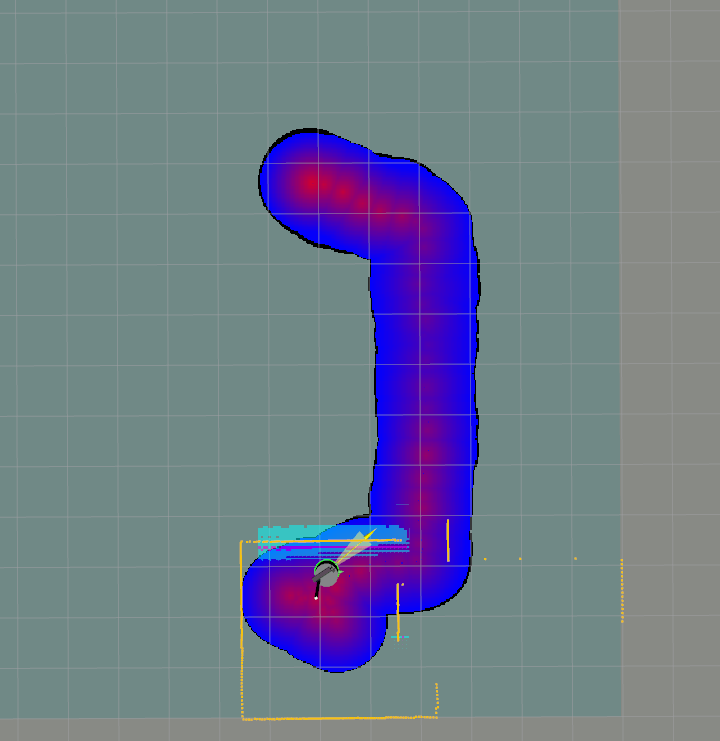
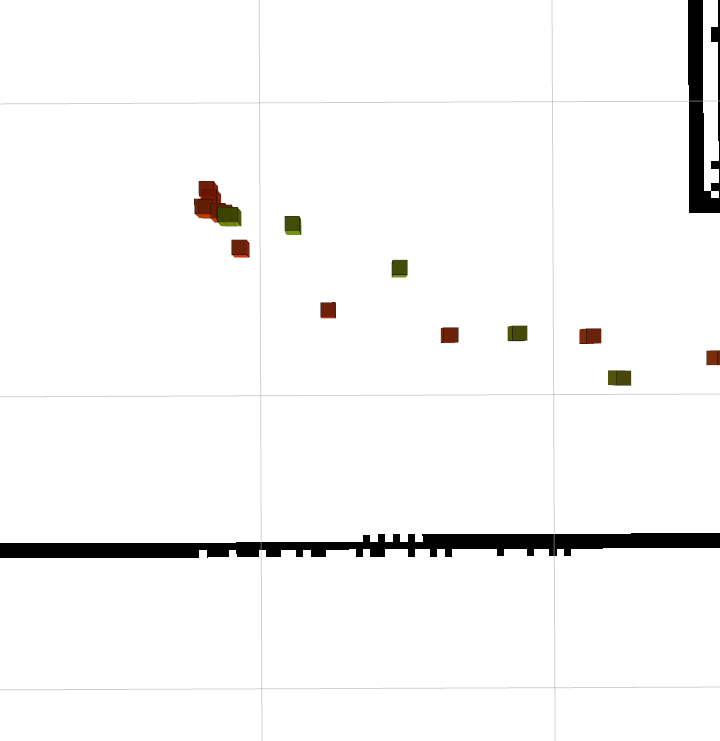
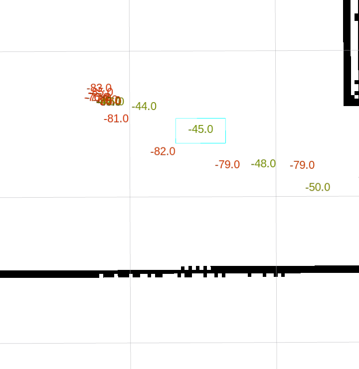

**Note:** This repository contains slightly modified code by Michael Wimble, the original is here:

https://github.com/wimblerobotics/wifi_logger_visualizer

All credits go to Michael Wimble.

----------

# WiFi Logger Visualizer

A ROS2 package for logging WiFi signal data and visualizing it as cost maps and heat maps.

Here is an example of the cost maps generated by the visualizer node in rviz2:



Here is an example of the heat map in rviz2:



Here is an example of the text heat map in rviz2:



## Overview

This package provides three main nodes:

1. **WiFi Logger Node**: Collects WiFi signal data (link quality, signal level, bit rate) at the robot's current position and stores it in a SQLite database.
2. **WiFi Visualizer Node**: Reads data from the database and publishes cost maps showing WiFi signal strength across the environment.
3. **Heat Mapper Node**: Provides alternative visualization options including heat maps and value markers.

**Note:** this software runs under **Ubuntu 24.04** and **ROS2 Jazzy**. Familiarity with these environments is required.

## Features

- Real-time WiFi signal data collection
- Automatic position tracking using odometry and transforms
- SQLite database storage for persistent data
- Three different cost map visualizations:
  - Link Quality (0-1)
  - Signal Level (-90 to -30 dBm)
  - Bit Rate (0-1000 Mb/s)
- Configurable interpolation distance
- Automatic database change detection
- Optimized for real-time performance
- Heat map visualization with matplotlib
- Value markers with color-coded signal strength
- Text annotations showing exact signal values
- Configurable scale factor for visualization

## Dependencies

- ROS2 (tested with Jazzy)
- Python 3.8+
- Matplotlib
- SQLite3
- NumPy
- Seaborn
- SciPy
- ROS2 [rviz_2d_overlay_plugins](https://github.com/teamspatzenhirn/rviz_2d_overlay_plugins) package

## Installation

1. Clone this repository into your ROS2 workspace:
   ```
   mkdir -p ~/robot_ws/src
   cd ~/robot_ws/src
   git clone https://github.com/slgrobotics/wifi_logger_visualizer.git
   ```

2. Install dependencies:
   ```
   sudo apt install python3-scipy python3-seaborn wireless-tools sqlite3  ros-${ROS_DISTRO}-rviz-2d-overlay-plugins

   cd ~/robot_ws
   sudo rosdep init    # do it once, if you haven't done it before
   rosdep update
   rosdep install --from-paths src --ignore-src --rosdistro=${ROS_DISTRO} -r -y
   ```

3. Build the package:
   ```
   cd ~/robot_ws
   colcon build
   ```

4. Source the workspace:
   ```
   source install/setup.bash
   ```

## Usage

I have included a sample databbase that you can use to test various forms of visualization. In the commands below that want a **db_path** parameter,
or if you want to run **sqlite3** commands on the sample database, you can set the value to the path of the sample database which is called **sample_wifi_data.db**.
Just make sure the value of **db_path** resolves
to the full path of the file.
E.g., if you have a folder called **/home/ubuntu/wifi_logger_visualizer_ws** where you installed
this package under the **src/wifi_logger_visualizer** directory, then the full path to the sample database is **/home/ubuntu/wifi_logger_visualizer_ws/src/wifi_logger_visualizer/sample_wifi_data.db**. Here's an example:

```bash
ros2 launch wifi_logger_visualizer heat_mapper.launch.py db_path:=/home/ubuntu/wifi_visualizer_logger_ws/src/wifi_logger_visualizer/sample_wifi_data.db standalone:=true
```
To run either node separately or together use the following commands:
```
cd ~/robot_ws
source install/setup.bash

ros2 launch wifi_logger_visualizer wifi_logger.launch.py

ros2 launch wifi_logger_visualizer wifi_visualizer.launch.py

ros2 launch wifi_logger_visualizer wifi_logger_visualizer.launch.py

ros2 launch wifi_logger_visualizer heat_mapper.launch.py standalone:=true
```
**Note:** _sqlite3_ database file will be created in the directory where you run Logger node: 
```
-rw-r--r--  1 ros ros 102400 Apr  2 12:09 wifi_data.db
```
Refer to [database](https://github.com/slgrobotics/wifi_logger_visualizer/tree/main/database) folder for viewing the data.
You can use sample database from that folder to try sample _Heat Mapper_ code:
```
cd ~/robot_ws/src/wifi_logger_visualizer/wifi_heat_mapper
python3 heat_mapper.py
```


### WiFi Logger Node

The logger node collects WiFi data at the robot's current position:

```bash
ros2 launch wifi_logger_visualizer wifi_logger.launch.py
```

Parameters:
- `db_path`: Path to the SQLite database file (default: `wifi_data.db` in current directory)
- `wifi_interface`: WiFi interface name (default: auto-detect)
- `update_interval`: How often to collect data in seconds (default: 1.0)
- `max_signal_strength`: Maximum expected signal strength in dBm (default: -30.0)
- `min_signal_strength`: Minimum expected signal strength in dBm (default: -90.0)
- `publish_metrics`: if True, logger will publish `/wifi/metrics` topic of type _Float32MultiArray_ (default: True)
- `publish_overlay`: if True, logger will publish `/wifi/overlay` topic of type _OverlayText_ (default: True)

Signal strength is expected to be in the range of -90 dBm (weak) to -30 dBm (strong). The logger will only collect data within this range.

The `/wifi/metrics` topic with *[bit_rate, link_quality, signal_level]* array can be used, for example, for avoiding areas with weaker WiFi reception.

The `/wifi/overlay` topic can be used by RViz2 to view complete information about the connection, using [rviz_2d_overlay_plugins package](https://github.com/teamspatzenhirn/rviz_2d_overlay_plugins).

**Note:** the Logger's overlay may conflict with [Battery Display](https://github.com/slgrobotics/robots_bringup/blob/main/Docs/Sensors/BatteryStateBroadcaster.md#displaying-battery-state-data-in-rviz2) - 
they are both configured by default to reside in upper left corner of RViz2. Resolve this conflict by modifying *vertical_distance* value.

### WiFi Visualizer Node

The visualizer node creates cost maps from the collected data:

```bash
ros2 launch wifi_logger_visualizer wifi_visualizer.launch.py
```

Parameters:
- `db_path`: Path to the SQLite database file (default: `wifi_data.db` in current directory)
- `publish_frequency`: How often to publish cost maps in Hz (default: 1.0)
- `db_check_frequency`: How often to check for database updates in Hz (default: 2.0)
- `max_interpolation_distance`: Maximum distance for interpolation in meters (default: 1.0)
- `enable_link_quality`: Enable link quality cos tmap (default: true). Topic will be published to **/wifi_link_quality_costmap**
- `enable_signal_level`: Enable signal level cost map (default: true) Topic will be published to **/wifi_signal_level_costmap**
- `enable_bit_rate`: Enable bit rate cos tmap (default: true). Topic will be published to **/wifi_bit_rate_costmap**
- `costmap_topic`: Topic to read cost map dimensions from (default: **/global_costmap/costmap**)

### Heat Mapper Node

The heat mapper node provides alternative visualization options:

```bash
ros2 launch wifi_logger_visualizer heat_mapper.launch.py
```

Parameters:
- `standalone`: Whether to display matplotlib visualization (true) or publish markers (false) (default: false)
- `db_path`: Path to the SQLite database file (default: **wifi_data.db** in current directory)
- `scale_factor`: Scale factor for the heat map visualization (default: 1.0)
- `text_size`: Size of the text markers in meters (default: 0.08)
- `do_publish_markers`: Whether to publish value markers (default: true). Markers are published to the **/wifi_heat_markers** topic.
- `do_publish_text_markers`: Whether to publish text markers (default: true) Markers are published to the **/wifi_heat_text_markers** topic.

The heat mapper node can operate in two modes:
1. **Standalone Mode**: Displays a matplotlib heat map with signal strength values
2. **ROS Mode**: Publishes visualization markers that can be viewed in rviz2:
   - Value markers showing signal strength with color gradients
   - Text markers displaying exact signal values
   - Topics:
     - **/wifi_heat_markers**: Color-coded value markers
     -  **/wifi_heat_text_markers**: Text annotations with signal values

## Viewing the Cost maps

To view the cost maps in rviz2:

1. Launch rviz2:
   ```bash
   rviz2
   ```

2. Add an OccupancyGrid display
3. Set the topic to one of:
   - `/wifi_link_quality_costmap`
   - `/wifi_signal_level_costmap`
   - `/wifi_bit_rate_costmap`

## Database Schema

The SQLite database contains a table with the following columns:
- `timestamp`: When the data was collected
- `x`: X coordinate in meters
- `y`: Y coordinate in meters
- `bit_rate`: WiFi bit rate in Mb/s
- `link_quality`: Link quality (0-1)
- `signal_level`: Signal level in dBm

Only the most recent data point for each (x, y) coordinate is stored. The logger node will automatically create the database if it doesn't exist.
The visualizer node will automatically detect changes in the database and update the cost maps accordingly.

## Useful sqlite commands
- To view the database schema:
  ```bash
  sqlite3 wifi_data.db
  .schema
  ```
- To view the data:
  ```bash
  sqlite3 wifi_data.db
  .headers on
  SELECT * FROM wifi_data;
  ```

Sample output:
```bash
sqlite> select * from wifi_data limit 3;
id|timestamp|x|y|bit_rate|link_quality|signal_level
1|2025-04-01 19:03:58|8.81000000000088|2.59000000000011|1200.9|1.0|-39.0
2|2025-04-01 19:17:06|3.15298861662747e-13|2.10237650673698e-25|1200.9|1.0|-39.0
3|2025-04-01 19:17:07|3.15298837078504e-13|2.10237640138469e-25|1200.9|1.0|-35.0
```

## Troubleshooting

- If the logger node can't find your WiFi interface, specify it manually with the `wifi_interface` parameter
- If the visualizer node doesn't show data, check that the database path is correct
- If cost maps don't appear in rviz2, make sure the frame_id matches your map frame

## Code tested with:
- Ubuntu 24.04
- ROS2 Jazzy
- Python 3.8
- SQLite3
- NumPy
- SciPy
- RViz2
- ROS2 Navigation2
- ROS2 TF2
- ROS2 Odometry
- ROS2 Cost maps
- On Intel architecture
- On Raspberry Pi 4 and Pi 5

## Useful Links

Sqlite3 dtatabase:
- https://www.sqlite.org/quickstart.html
- https://github.com/sqlite/sqlite
- https://www.sqlite.org/

WiFi heatmapping software for iOS and Android (just for reference, I haven't used any of these):
- [WiFi Heatmap](https://play.google.com/store/apps/details?id=ua.com.wifisolutions.wifiheatmap&hl=en_US&pli=1)
- [ekahau WiFi Heatmaps](https://www.ekahau.com/solutions/wi-fi-heatmaps/)
- [NetSpot](https://www.netspotapp.com/wifi-heat-map/best-wifi-heatmap-software.html)  (available for [iOS](https://apps.apple.com/us/app/netspot-wifi-analyzer/id1490247223))

ROS2 Jazzy setup:
- Intel Desktop: https://github.com/slgrobotics/robots_bringup/tree/main/Docs/ROS-Jazzy
- Raspberry Pi: https://github.com/slgrobotics/robots_bringup/tree/main/Docs/Ubuntu-RPi

For _robot software_ see:
- My Robots - [Plucky, Dragger, Turtle](https://github.com/slgrobotics/robots_bringup)

## License

This package is licensed under the MIT License.

## Contributions

I'd like to thank Sergei Grichine for his large contributions to this project, especially to the standalone heat map code. Please visit his [github](https://github.com/slgrobotics) and add a star in recognition for his many contributions to robotics.
